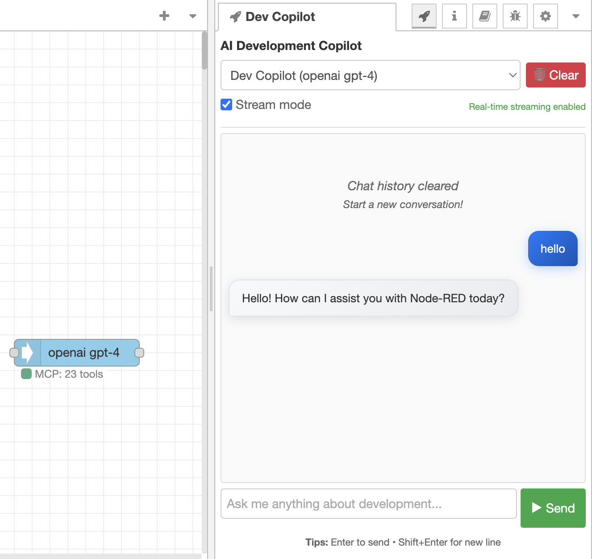
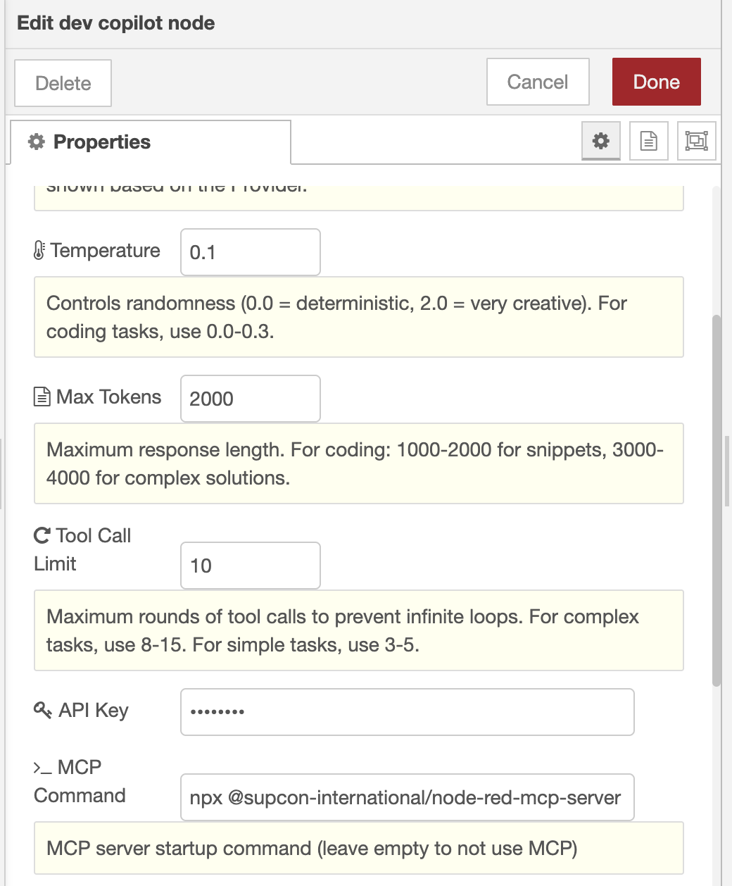

# Node-RED Dev Copilot

An AI programming assistant sidebar plugin for Node-RED with MCP (Model Context Protocol) support.

[](https://www.npmjs.com/package/@supcon-international/node-red-dev-copilot) [](https://www.npmjs.com/package/@supcon-international/node-red-dev-copilot) [](https://www.npmjs.com/package/@supcon-international/node-red-dev-copilot)   

[中文文档](README_zh.md)

## Key Features

- **Multi-Platform AI Support**: Works with OpenAI, Google Gemini, DeepSeek and other mainstream AI services
- **Real-time Streaming**: Server-Sent Events (SSE) based streaming responses for immediate feedback,default true
- **MCP Protocol Integration**: Auto-discovers and calls MCP tools, combined with our Node-RED MCP server for powerful AI assistance in Node-RED development
- **Intelligent Tool Calling**: AI automatically selects and executes relevant tools as needed
- **Sidebar Interface**: Use directly within the Node-RED editor without switching interfaces
- **Multi-Node Switching**: Switch freely between different LLM nodes while maintaining unified chat history
- **Secure Storage**: Uses Node-RED's built-in credentials management mechanism
- **Conversation History**: Supports multi-turn conversations with records saved in Node-RED global storage
- **Flow Node**: Can be used as a regular node in flows besides the sidebar

## Screenshots

### Sidebar Chat Interface

Chat directly with the AI assistant in the Node-RED editor's right panel for development assistance:



**Key Features:**

- **Smart Conversations**: Ask Node-RED development questions directly
- **Tool Integration**: AI automatically calls MCP tools to assist development
- **Chat History**: Conversations are automatically saved with multi-turn support
- **Node Switching**: Switch freely between different configured LLM nodes

### Node Configuration Interface

Simple configuration to get started, supporting multiple mainstream AI services:



**Configuration Highlights:**

- **AI Services**: Supports OpenAI, Google Gemini, DeepSeek
- **Secure Storage**: API keys stored securely via Node-RED's credential system
- **Parameter Tuning**: Adjustable temperature, max tokens, and other parameters
- **MCP Integration**: default node-red mcp

## Quick Start

### Installation Methods

**Recommended**: Search for `@supcon-international/node-red-dev-copilot` in Node-RED's Manage palette

Or install via npm:

```bash
cd ~/.node-red
npm install @supcon-international/node-red-dev-copilot
```

Manual installation:

```bash
cd ~/.node-red
git clone https://github.com/supcon-international/node-red-dev-copilot.git
cd node-red-dev-copilot
npm install
```

Restart Node-RED after installation.

## Configuration Guide

### Basic Setup

To save chat history, configure persistent storage in Node-RED's `settings.js`:

```javascript
// ~/.node-red/settings.js
contextStorage: {
    default: {
        module: "localfilesystem",
    }
},
```

After this configuration:

- Chat history will be saved to files and persist after restarts
- Multiple browsers can share chat data
- Data is stored in `~/.node-red/context/global/global.json`

It works without this configuration, but chat history will only be valid during the current session.

### Adding and Configuring Nodes

1. Drag the "dev copilot" node from the "AI dev copilot" category to the canvas
2. Double-click the node to configure

Main configuration options:

**AI Service Settings**

- Provider: Choose AI provider (openai/google/deepseek)
- Model: Model name (e.g., gpt-4, gemini-2.5-pro, deepseek-chat)
- API Key: Corresponding service API key
- Temperature: Randomness control (0-2, recommended 0.1-0.3 for programming)
- Max Tokens: Maximum response length (recommended 2000-4000)
- Tool Call Limit: Tool call round limit (recommended 10-15)

**MCP Server Settings** (optional)

- MCP Command: Server startup command (default: `npx @supcon-international/node-red-mcp-server`)
- Arguments: Command line arguments
- Environment Variables: Environment variables (format: KEY=value,KEY2=value2)
- System Prompt: Custom system prompt

### Configuration Examples

**OpenAI Configuration**

```
Provider: openai
Model: gpt-4
API Key: sk-xxx...
Temperature: 0.1
Max Tokens: 2000
```

**Google Gemini Configuration**

```
Provider: google
Model: gemini-2.5-pro
API Key: AIxxx...
Temperature: 0.1
Max Tokens: 2000
```

**DeepSeek Configuration**

```
Provider: deepseek
Model: deepseek-chat
API Key: sk-xxx...
Temperature: 0.1
Max Tokens: 2000
```

## Usage

### Sidebar Chat

1. After configuring nodes, click the "Dev Copilot" tab on the right
2. Select the node to use (remembers your last choice)
3. Enter your question and press Enter to send
4. AI will automatically call MCP tools to assist with development work

Chat history is automatically saved and will restore after page refresh. Use the "Clear" button to remove all records.

### As Flow Node

Can also be used as a regular node in flows:

```javascript
// Input format
{
    payload: "How to create an HTTP request node?",
    history: [  // Optional conversation history
        {role: "user", content: "Previous question"},
        {role: "assistant", content: "Previous answer"}
    ]
}

// Output format
{
    payload: "AI response",
    llm_config: { provider: "openai", model: "gpt-4", ... },
    mcp_available: true,
    mcp_tools: [...]  // Available MCP tools list
}
```

## MCP Integration

Supports standard MCP functionality:

- Tools: Call tools provided by MCP servers
- Resources: Access MCP server resources
- Prompts: Use MCP server prompt templates
- Stdio Transport: Communicate with MCP servers via standard input/output

Recommended to use with our Node-RED MCP server:

```bash
npx @supcon-international/node-red-mcp-server
```

## API Endpoints

The plugin provides the following HTTP interfaces:

- `GET /dev-copilot/sidebar` - Get sidebar page
- `POST /dev-copilot/chat` - Send chat message (non-streaming)
- `POST /dev-copilot/chat-stream` - Send chat message with Server-Sent Events streaming
- `GET /dev-copilot/nodes` - Get available nodes list

## Development

### Project Structure

```
node-red-dev-copilot/
├── package.json              # Package configuration
├── nodes/
│   ├── dev-copilot.js       # Node backend logic
│   └── dev-copilot.html     # Node frontend and sidebar registration
├── public/
│   └── sidebar.html         # Sidebar interface
├── mcp/
│   └── mcp-client.js        # MCP client
└── README.md                # Documentation
```

### Local Development

```bash
git clone https://github.com/supcon-international/node-red-dev-copilot.git
cd node-red-dev-copilot
npm install

# Link to Node-RED
cd ~/.node-red
npm link /path/to/node-red-dev-copilot
```

Then restart Node-RED for testing.

## Common Issues

**Sidebar not showing**

- Check Node-RED version >= 3.0.0
- Confirm plugin installation is correct
- Check browser console for errors

**MCP connection failed**

- Check MCP server path
- Verify parameter format is correct
- Can test with [MCP Inspector](https://github.com/modelcontextprotocol/inspector)

**API call failed**

- Confirm API key is valid
- Check network connection
- Verify model name is correct
- Confirm API balance is sufficient

**Chat history not saving**

- Check contextStorage configuration in settings.js
- Confirm Node-RED has write permissions to context directory
- Restart Node-RED after configuration changes

### View Logs

```bash
# View Node-RED logs
tail -f ~/.node-red/node-red.log

# Enable detailed logs
DEBUG=node-red:* node-red
```

## Future Plans

- Optimize long conversation handling to avoid slow responses
- Add API usage statistics functionality
- Improve caching mechanism to reduce duplicate calls
- Support more MCP servers

## Contributing

Issues and Pull Requests are welcome.

Standard process:

1. Fork this project
2. Create feature branch (`git checkout -b feature/new-feature`)
3. Commit changes (`git commit -m 'Add some feature'`)
4. Push to branch (`git push origin feature/new-feature`)
5. Create Pull Request

## License

MIT License - see [LICENSE](LICENSE) file for details

## Technical Support

If you encounter issues:

1. Check this documentation and [Chinese documentation](README_zh.md)
2. Search [existing Issues](https://github.com/supcon-international/node-red-dev-copilot/issues)
3. Create new Issue describing the problem

---
